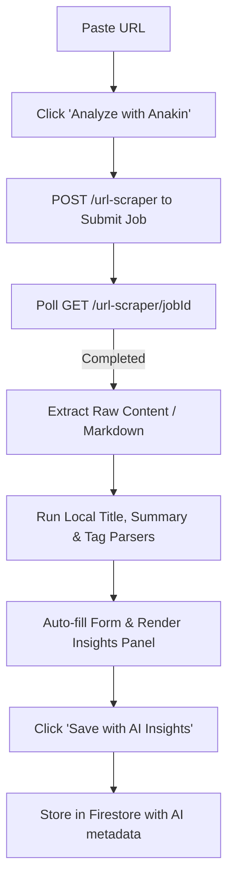
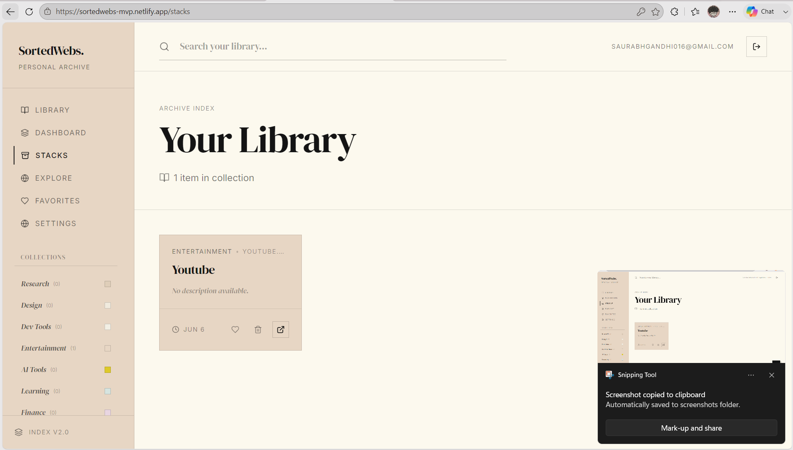
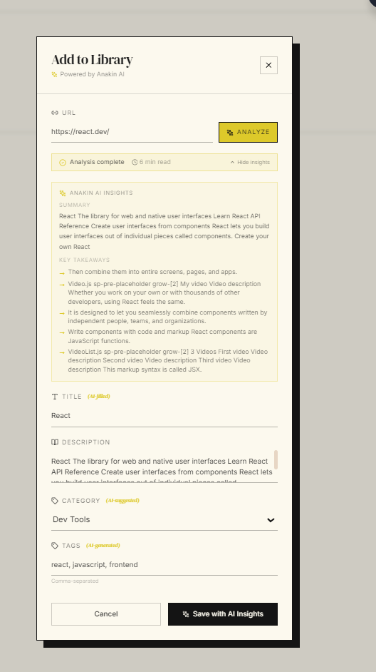
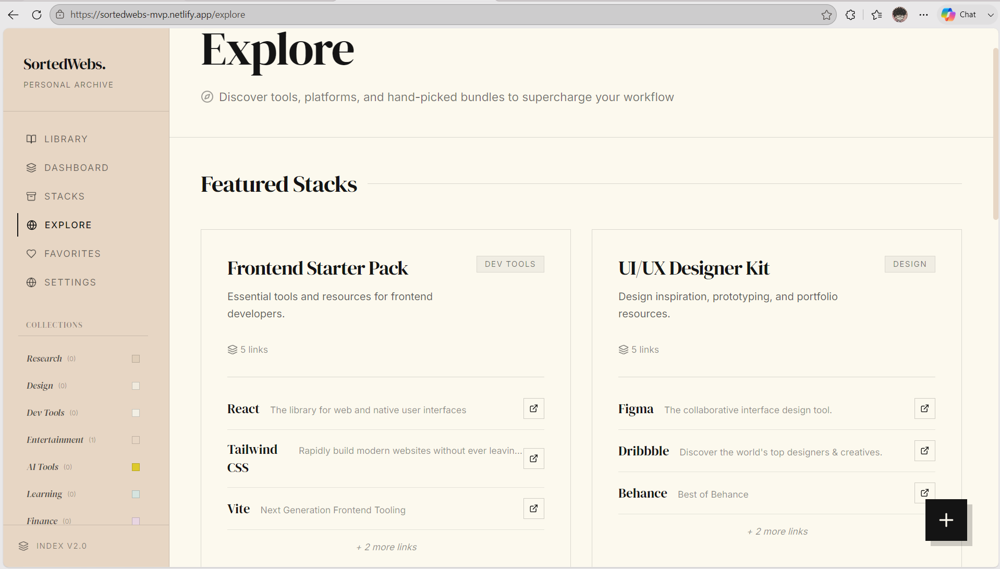

<div align="center">

# 🚀 SortedWebs (Anakin Edition)

> **AI-Powered Knowledge Library & Curator.**  
> Turn simple bookmarks into summarized, tagged, categorized, and searchable knowledge resources.

[](https://react.dev)
[](https://www.typescriptlang.org)
[](https://tailwindcss.com)
[](https://vitejs.dev)
[](https://firebase.google.com/)
[](https://anakin.ai)

---

### 🏆 Built for Anakin Blitz 2026

</div>

---

## 📖 Overview

### ⚠️ The Problem
Every day developers, students, researchers, and creators save dozens of useful links. Over time, these bookmarks become impossible to manage because they contain no context, no organization, and no way to quickly rediscover knowledge. They are simply raw, forgotten URLs.

### 💡 The Solution
**SortedWebs** transforms a simple bookmark manager into a premium, searchable knowledge resource. By integrating the **Anakin Universal Scraper REST API**, SortedWebs fetches full page content on demand, parses it locally to extract metadata, and automatically generates:
- 📝 A 2-sentence clean summary (max 220 characters).
- 🏷️ Custom context-aware tags.
- 🗂️ A category classification (e.g., Dev Tools, Learning, AI Tools).
- ⏱️ An estimated reading time.

---

## ⚡ Core Anakin Workflow

When you click **Analyze with Anakin**, SortedWebs initiates a multi-stage pipeline:



1. **Submit Job:** The application submits the URL to the Anakin Universal Scraper (`POST /url-scraper`).
2. **Poll Status:** The application polls (`GET /url-scraper/{jobId}`) until the scrape is completed.
3. **Local Parser:** SortedWebs extracts page text and filters navigation boilerplate, image link tags, and cookie banners.
4. **Generate Metadata:**
   - **Title:** Extracted from parsed `<title>` tags, markdown headings, or capitalized domains.
   - **Summary:** First 2 sentences of clean prose.
   - **Tags:** Curated keywords derived from domains and page terms.
   - **Category:** Assigned based on domain rules and content flags.

---

## ✨ Features

- **🧠 Auto-filled Form Fields:** Scraping metadata instantly populates the title, tags, category, and summary fields.
- **⚡ AI Insights Preview:** Review summary highlights and key takeaways in the modal before committing a bookmark to the library.
- **🛡️ Stale Tags Protection:** Form states are cleared on every new click to prevent carrying over metadata from previous analyses.
- **🔐 Authentication:** Full user isolation powered by Firebase Auth.
- **☁️ Cloud Sync & Real-Time Updates:** Instant synchronization across tabs with Firestore.
- **🔍 Expanded Search:** Search matching looks through titles, tags, summaries, categories, and key takeaways for instant discovery.

---

## 🖼️ Screenshots

*Placeholders for product walkthrough screenshots:*

#### 🏠 Personal Knowledge Library
<p align="center">
  
</p>

#### ✦ Add Links with Anakin AI
<p align="center">
  
</p>

#### 🗂️ Curated Stacks & Explore
<p align="center">
  
</p>

---

## 🛠️ Tech Stack

- **Frontend:** React, TypeScript, Vite, Tailwind CSS, Lucide Icons, Mermaid.js
- **Backend:** Firebase (Auth, Firestore)
- **Scraper / AI Workflow:** [Anakin Universal Scraper REST API](https://anakin.ai)

---

## 📂 Project Structure

```text
sortedwebs/
├── public/                 # Static public assets
├── src/
│   ├── components/         # AddLinkFab (w/ Anakin flow), WebsiteCard, etc.
│   ├── hooks/              # useWebsites (Firestore writes), useStacks, etc.
│   ├── services/           # anakinService.ts (Submit + Poll + Local parsers)
│   ├── lib/                # Firebase configuration & initialization
│   ├── pages/              # Dashboard, Explore, collections view
│   ├── App.tsx             # Main routing & Auth guards
│   └── index.css           # Global typography & Tailwind styles
├── firestore.rules         # Security rules for data isolation
├── .env.example            # Environment variables template
└── package.json            # Scripts & configurations
```

---

## 🚀 Getting Started

### Installation

1. **Clone the repository:**
   ```bash
   git clone <repo-url>
   cd sortedwebs
   ```

2. **Install dependencies:**
   ```bash
   npm install
   ```

3. **Setup environment variables:**
   Copy `.env.example` to `.env`:
   ```bash
   cp .env.example .env
   ```
   Fill in your Firebase credentials and your Anakin API Key:
   ```env
   VITE_FIREBASE_API_KEY=AIzaSy...
   VITE_ANAKIN_API_KEY=your_key_here
   ```

4. **Start the local server:**
   ```bash
   npm run dev
   ```

---

## 🎤 Presentation Demo Flow

Follow this flow for video demonstrations or live judge walkthroughs:

1. **The Dashboard:** Show the homepage populated with clean editorial cards.
2. **Open Add Link:** Click the bottom-right `+` button.
3. **Paste URL:** Enter `https://react.dev` into the input field.
4. **Trigger Anakin:** Click `✦ Analyze`. Points out how the loading state updates.
5. **Form Populate:** Show how the Title auto-populates as `"React"`, Category becomes `"Dev Tools"`, and Tags list `"react, javascript, frontend"`.
6. **Save:** Save the card and show it instantly appearing on the dashboard with its "AI" badge.
7. **Filter & Search:** Type `react` or click the `Dev Tools` category to demonstrate instant index filtering.

---

## 🔮 Future Scope

- [ ] **Anakin LLM integration:** Leverage Anakin AI chatbots to generate custom contextual flashcards directly in the dashboard.
- [ ] **Browser Extension:** One-click save to library from the browser bar.
- [ ] **Collaborative Stacks:** Shared libraries for team curation.
- [ ] **Offline Sync:** Local-first storage with background Firestore synchronization.

---

## 👨‍💻 Credits & Author

Built for the **Anakin Blitz Hackathon 2026** by **Saurabh Gandhi**.

- **GitHub:** [saurabhkun](https://github.com/saurabhkun)
- **LinkedIn:** [Saurabh Gandhi](https://www.linkedin.com/in/saurabh-gandhi-1421b2318/)
- **Email:** saurabhgandhi016@gmail.com
- **Support:** If you love the project, please leave a star on GitHub! ⭐️
