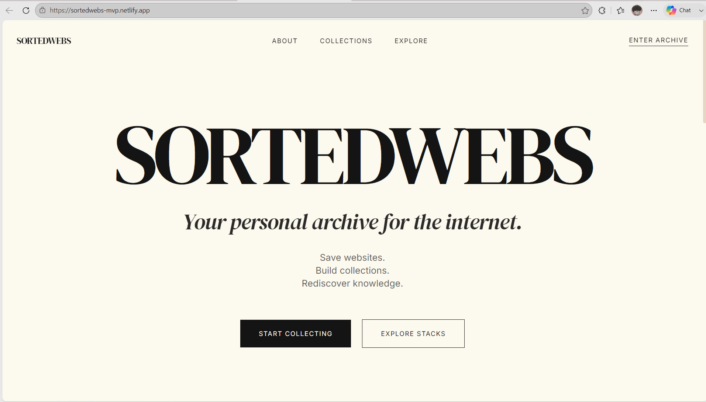
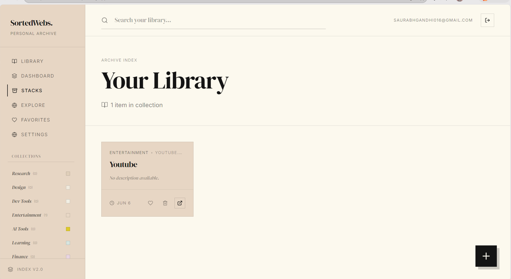

<div align="center">

# 🚀 SortedWebs

> **The Personal Web Library & Curator.**  
> Save. Organize. Discover. Share.

[](https://react.dev)
[](https://www.typescriptlang.org)
[](https://tailwindcss.com)
[](https://vitejs.dev)
[](https://firebase.google.com/)
[](https://firebase.google.com/products/firestore)
[](https://choosealicense.com/licenses/mit/)
[](https://github.com/saurabhkun)
[](https://www.linkedin.com/in/saurabh-gandhi-1421b2318/)

<p align="center">
  
</p>

</div>

---

## 📖 Overview

**The Problem:** We save hundreds of useful websites, articles, and tools every month - but when we actually need them, they are lost in chaotic browser bookmarks or scattered across dozens of different apps.

**The Solution:** SortedWebs helps you build a clean, intelligent personal web library. With smart categorization, curated stacks, and public collections, discovering and organizing knowledge has never felt this premium.

---

## 📚 Personal Library

Save websites instantly and organize them forever. Never lose a valuable link again.

<p align="center">
  
</p>

---

## ➕ Add Resources

Capture resources instantly. Add links with metadata, categories, and tags.

<p align="center">
  
</p>

---

## 🔍 Explore

Discover curated resources. Explore useful collections and stacks shared by the community.

<p align="center">
  
</p>

---

## 🗂️ Collections & Stacks

Build knowledge stacks. Group resources into focused collections tailored for developers, designers, and learners.

<p align="center">
  
</p>

---

## ⚙️ Core Capabilities

- **🧠 Smart Category Suggestions:** Automatically suggests relevant categories directly from URLs and website metadata, saving you time.
- **🔐 Authentication:** Rock-solid, secure Email + Password authentication powered entirely by Firebase.
- **☁️ Cloud Sync:** All of your data is securely stored and managed in Firestore, providing reliable long-term persistence.
- **⚡ Real-Time Updates:** Instant synchronization across all your sessions. What you save on one tab appears everywhere immediately.

---

## 🏗 Architecture

```text
User
 │
 ▼
React + TypeScript
 │
 ▼
Firebase Authentication
 │
 ▼
Firestore Database
 │
 ├── users/{uid}/links
 ├── users/{uid}/stacks
 └── publicStacks
```

---

## 🛠 Tech Stack

**Frontend:**
- ⚛️ [React](https://react.dev)
- 📘 [TypeScript](https://www.typescriptlang.org)
- ⚡ [Vite](https://vitejs.dev)
- 💅 [Tailwind CSS](https://tailwindcss.com)

**Backend:**
- 🔐 [Firebase Authentication](https://firebase.google.com/products/auth)
- 🗄️ [Firestore Database](https://firebase.google.com/products/firestore)

**Deployment:**
- 🚀 [Vercel](https://vercel.com)

---

## 📂 Project Structure

```text
sortedwebs/
├── public/                 # Static assets
├── src/
│   ├── components/         # Reusable UI components
│   ├── hooks/              # Custom React hooks (auth, db interactions)
│   ├── lib/                # Config files (Firebase, curated datasets)
│   ├── pages/              # Application views (Dashboard, Explore, etc.)
│   ├── App.tsx             # Main router configuration
│   └── index.css           # Global Tailwind and base styles
├── firestore.rules         # Security rules for Firestore access
└── package.json            # Project dependencies and scripts
```

---

## 🚀 Getting Started

### Installation

Clone the repository and install the required dependencies:

```bash
git clone <repo>
cd sortedwebs
npm install
npm run dev
```

### Environment Variables

Create a `.env` file in the root of your project and populate it with your Firebase configuration:

```env
VITE_FIREBASE_API_KEY=your_api_key
VITE_FIREBASE_AUTH_DOMAIN=your_auth_domain
VITE_FIREBASE_PROJECT_ID=your_project_id
VITE_FIREBASE_STORAGE_BUCKET=your_storage_bucket
VITE_FIREBASE_MESSAGING_SENDER_ID=your_messaging_sender_id
VITE_FIREBASE_APP_ID=your_app_id
```

---

## 🔥 Curated Starter Stacks

Explore features pre-built curated bundles to get you started on day one:

- **Frontend Starter Pack:** Essential tools and resources for modern web development.
- **UI/UX Designer Kit:** Design inspiration, prototyping tools, and portfolio resources.
- **AI Productivity Stack:** The best AI tools for research, writing, coding, and discovery.
- **Competitive Programming Stack:** Practice platforms and references for interview prep.
- **Indie Hacker Stack:** Everything you need to build, ship, and monetize side projects.
- **Research Desk:** Useful research, paper discovery, and academic directories.

---

## 🗺 Roadmap

- [ ] **Browser Extension:** Save links directly from your browser.
- [ ] **Public Profiles:** Share your custom library with the world.
- [ ] **Team Collections:** Collaborative bookmarking for startups and teams.
- [ ] **AI Summaries:** Automated one-sentence summaries for saved articles.
- [ ] **Recommendation Engine:** Discover new content based on your library.
- [ ] **Mobile App:** Access SortedWebs seamlessly on iOS and Android.

---

## 🤝 Contributing

We love contributions! Whether it's adding new features, fixing bugs, or improving documentation, your help is welcome.

1. Fork the project.
2. Create your Feature Branch (`git checkout -b feature/AmazingFeature`).
3. Commit your changes (`git commit -m 'Add some AmazingFeature'`).
4. Push to the Branch (`git push origin feature/AmazingFeature`).
5. Open a Pull Request.

---

## 👨‍💻 Author

Built with ❤️ by **Saurabh Gandhi**

- GitHub: https://github.com/saurabhkun
- LinkedIn: https://www.linkedin.com/in/saurabh-gandhi-1421b2318/
- Email: saurabhgandhi016@gmail.com

---

## 📬 Contact

GitHub: https://github.com/saurabhkun

LinkedIn: https://www.linkedin.com/in/saurabh-gandhi-1421b2318/

Email: saurabhgandhi016@gmail.com

---

## ⭐ Support

If you like the project, leave a star on GitHub. ⭐️
